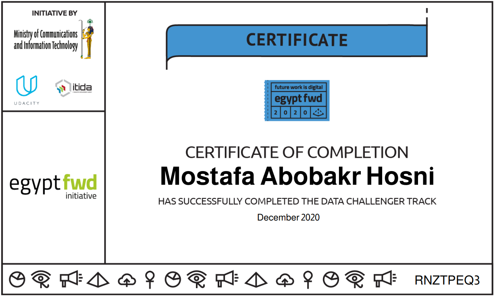

<h1 align="center">Data Analysis Challenger</h1>

<h7 align='center'>My XLSX solved files and certification of track exam</h7>

<a href="https://graduation.udacity.com/confirm/RNZTPEQ3">Udacity Transcript Endorsement</a>

### Core Curriculum

7 PARTS
 0 PROJECTS

##PART 1
##Introduction to the Program
Welcome to Egypt "Future Work is Digital" initiative.

##PART 2
##Descriptive Statistics
Learn the basic concepts of data analysis and descriptive statistics.

##PART 3
##Spreadsheets
Learn how to manipulate, analyze and visualize data in Excel and Google Sheets.

##PART 4
##Business Metrics
Learn about business metrics across a wide range of business areas (marketing, sales, growth and finance). Finally, learn about forecasting sales and financial metrics.

##PART 5
##Digital Freelancing - Intro

##PART 6
Final Assessment

##PART 7
##Congratulations and Next Steps
Receive your Certificate of Completion.

