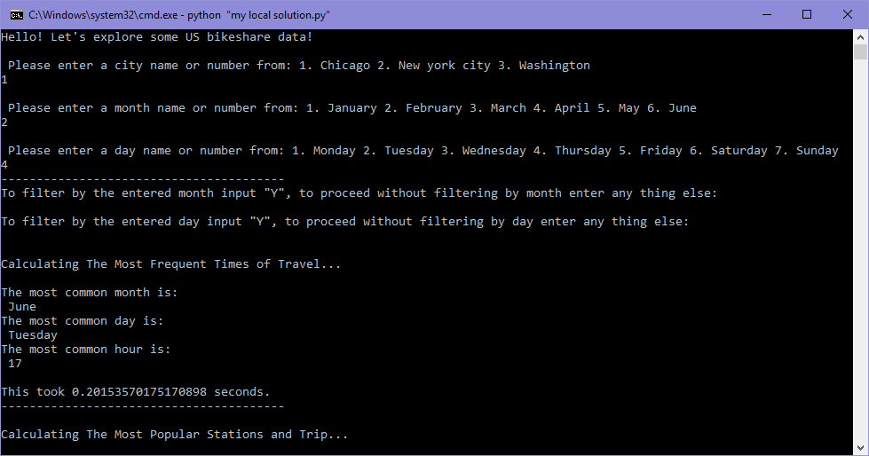

### [Project Script Code Preview](https://cutt.ly/1st-proj---Explore-US-Bikeshare-Data_Code-Preview)

### [1st Project](https://cutt.ly/1st-proj---Explore-US-Bikeshare-Data_Code-Preview), tasks short description

- The project was for writing a Python script to enable the user to do analysis on Bikeshare system data for cities; Chicago, New York City, and Washington, from their respective [three data sets](https://cutt.ly/1st-proj---Explore-US-Bikeshare-Data_XSLX-Workbooks), and to answer questions about popular times of travel, popular stations and trip, trip duration and user info.

*The picture below shows the data for the first 10 rides in the new_york_city.csv file*

 
*Running the python script*
 

*Click the photo to view the script code*

### Reviews highlights for my submissions
*__[1st review](https://cutt.ly/1st-proj---Explore-US-Bikeshare-Data_Review_1) highlights:__*

- Great work on the project till now. You’ve worked hard on the project and it clearly shows. 
- Everything runs free of errors. Nicely done! 🌟
- You have appropriately used lists and dataframes to carry out the analysis tasks. Reading everything into a
Pandas dataframe is one of the best first steps in making your data analysis project a success. You have
done well here. 🌟
- Loops and conditionals are appropriately used to process user input and calculate the statistics. 🌟
- Pandas is a great choice for solving this project! Great work on implementing its functionality to work out
the statistics! 🌟
- You have appropriately used docstrings and comments, and your variable names help understand the kind
of data being stored in that variable. 🌟
- Raw input is correctly handled including case-sensitivity. No errors are thrown on unexpected
inputs. 🌟
- Great job calculating all the statistics correctly.

*__[2nd review](https://cutt.ly/1st-proj---Explore-US-Bikeshare-Data_Review_2) highlights:__*

- Thank you so much for paying such attention to detail when fixing the minor comments made during previous review. The project looks
amazing now :)
- The script is neatly written and runs with great computational efficiency. What really stands out is the readability of your code -
everything from comments to spacing (this is such an important trait to have as a programmer). It was a pleasure to read through it.
- Really awesome work!
- Please keep up the good work and happy learning ahead!
 
