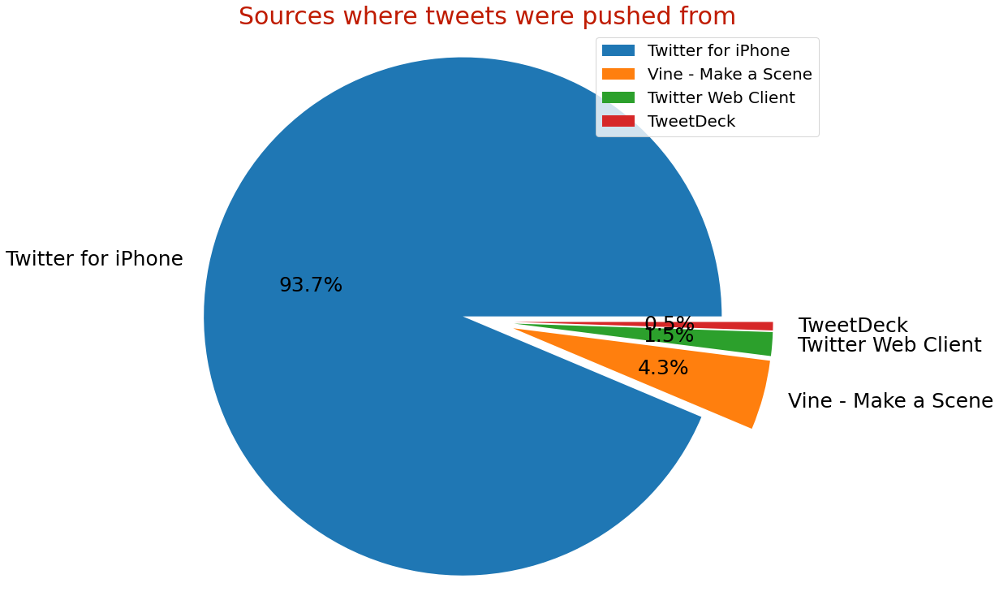

#### [Project Code Notebook Preview](https://cutt.ly/2nd-proj---Wrangle-and-Analyze-Data_Code-Preview)        ([Click here to view on "Jupyter Notebook Viewer"](https://cutt.ly/2nd-proj---Wrangle-and-Analyze-Data_Code-Preview_nbviewer))
#### Project Wrangle Report Preview: [**wrangle_report.pdf**](https://cutt.ly/2nd-proj---Wrangle-and-Analyze-Data_Wrangle-Report-Preview) or [**wrangle_report.ipynb**](https://cutt.ly/2nd-proj---Wrangle-and-Analyze-Data_Wrangle-Report-Preview_ipynb)        ([Click here to view on "Jupyter Notebook Viewer"](https://cutt.ly/2nd-proj---Wrangle-and-Analyze-Data_Wrangle-Report-Preview_ipynb_nbviewer))
#### Project Act Report Preview: [**act_report.pdf**](https://cutt.ly/2nd-proj---Wrangle-and-Analyze-Data_Act-Report-Preview) or [**act_report.ipynb**](https://cutt.ly/2nd-proj---Wrangle-and-Analyze-Data_Act-Report-Preview_ipynb)        ([Click here to view on "Jupyter Notebook Viewer"](https://cutt.ly/2nd-proj---Wrangle-and-Analyze-Data_Act-Report-Preview_ipynb_nbviewer))

*A photoshoot of the Viz of first insight shows different tweets sources*

 
*Click the viz to view the whole insights report*

### [2nd Project](https://cutt.ly/2nd-proj---Wrangle-and-Analyze-Data_Code-Preview), tasks short description

- The project was intended for wrangling and analyzing data after gathering from different three resources; offline file (`twitter-archive-enhanced.csv`), downloaded file (`image-predictions.tsv`) and Twitter API(`to have recieved tweets data of a twitter account for rating dogs stored in tweet_json.txt`), so as to extract insights (with one viz at least) from these data after assessing and cleaning tidiness and quality issues of them all.
- _**After all we should have**_:
    - [**wrangle_act.ipynb**](https://cutt.ly/2nd-proj---Wrangle-and-Analyze-Data_Code-Preview)**:** **code** for gathering, assessing, cleaning, analyzing, and visualizing data ([view on "Jupyter Notebook Viewer"](https://cutt.ly/2nd-proj---Wrangle-and-Analyze-Data_Code-Preview_nbviewer))
    - [**wrangle_report.pdf**](https://cutt.ly/2nd-proj---Wrangle-and-Analyze-Data_Wrangle-Report-Preview) or [**wrangle_report.ipynb**](https://cutt.ly/2nd-proj---Wrangle-and-Analyze-Data_Wrangle-Report-Preview_ipynb)**:** **documentation for data wrangling steps**: gather, assess, and clean ([view on "Jupyter Notebook Viewer"](https://cutt.ly/2nd-proj---Wrangle-and-Analyze-Data_Wrangle-Report-Preview_ipynb_nbviewer))
    - [**act_report.pdf**](https://cutt.ly/2nd-proj---Wrangle-and-Analyze-Data_Act-Report-Preview) or [**act_report.ipynb**](https://cutt.ly/2nd-proj---Wrangle-and-Analyze-Data_Act-Report-Preview_ipynb): **documentation of analysis and insights** into final data ([view on "Jupyter Notebook Viewer"](https://cutt.ly/2nd-proj---Wrangle-and-Analyze-Data_Act-Report-Preview_ipynb_nbviewer))
- _**with the datasets**_:
    - [twitter_archive_enhanced.csv](datasets/twitter-archive-enhanced.csv): file as given
    - [image_predictions.tsv](datasets/image-predictions.tsv): file downloaded programmatically
    - [tweet_json.txt](datasets/tweet-json.txt): file constructed via API
    - [twitter_archive_master.csv](https://cutt.ly/2nd-proj---Wrangle-and-Analyze-Data_Master-Cleaned-Dataset-Preview): combined and cleaned data

### Reviews highlights for my submissions

*__[1st review](https://cutt.ly/2nd-proj---Wrangle-and-Analyze_Review_1) highlights:__*

- Good start here! It is great to see that you have followed the project structure correctly in your wrangle act notebook. You have also cleaned
all of the important issues in the datasets and created nice reports describing your process and results.
- Code cells in the notebook are properly documented, good work here.
- Great job doing both visual and programmatic assessments properly and documenting the process in the Jupyter
notebook. You have performed various types of assessments, which is what I like about this particular section.
- However, you have grouped similar issues before cleaning them, and sometimes multiple issues took a fewer
number of lines to clean rather than cleaning them one by one, so I think we may give this specification a passing
mark.
- DataFrame objects were copied before cleaning, and a final cleaned dataset was created and filled with the cleaned data. Excellent work on this part.
- Well done with the visualizations and insights, they look great!

*__[2nd review](https://cutt.ly/2nd-proj---Wrangle-and-Analyze_Review_2) highlights:__*

- You have put dedicated effort into this project and it paid off. Congratulations on meeting all the specifications of the project! *__You have demonstrated a very good python coding skills and understanding__* of __data wrangling__ process.
- You have done an excellent job wrangling the given data and producing some interesting insights like __iphone is the most frequent platform for tweeting on this account__
- *__You also did a fantastic job__* of incorporating the previous reviewer suggestions. Congratulations! Keep up all the great work you are doing. Good luck with your future projects!
- Good job adding a __hyper-linked Table of Contents__ so that it is very easy to navigate through your notebook. This shows your attention to details.
- __Excellent job__ writing functional code, executing the code and displaying the output without any errors.
- __Good job__ clearly identifying the steps of the data wrangling process in markdown cells. The notebook is structured well. This helps to easily __follow__ your code. A good notebook structure also makes code maintenance easier.
- __Excellent job__ successfully gathering data from local file twitter_archive_enhanced.csv and from a URL
( image_predictions.tsv ) and imported them into separate pandas dataframes
- Good job __copying__ all the dataframes prior to cleaning.
- Nice job __capturing all stages of dogs__ when an image has dogs with different stages. __Many students miss this critical issue. Nice job digging deep into data and identify this issue.__
- Good job correctly extracting __decimal numerators__.
- Good job __removing retweets__ and retaining only original tweets as per project instruction as we are only interested in original tweets in our analysis.
- You have done a __good job__ using index argument in to_csv() function and setting it to False to avoid adding a unwanted index column in the saved file.
- You have done an excellent job producing this very interesting report explaining the insights you gained from
your analysis.

