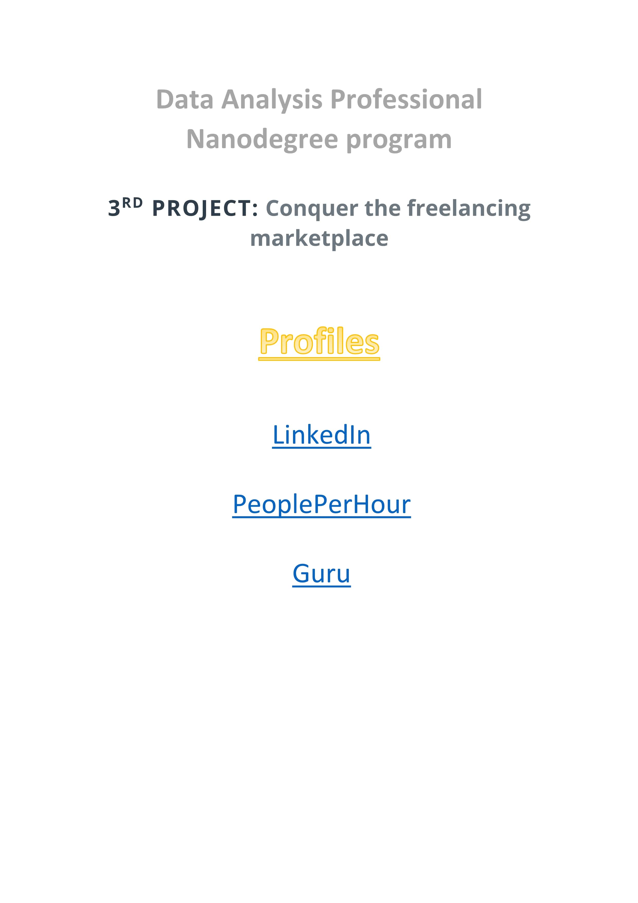
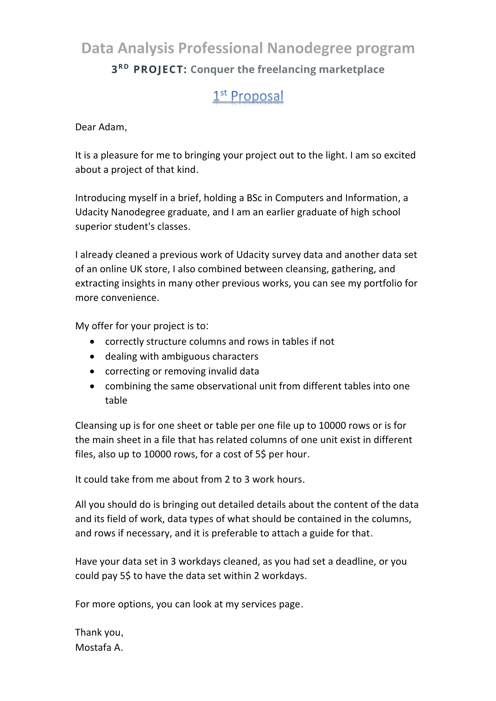
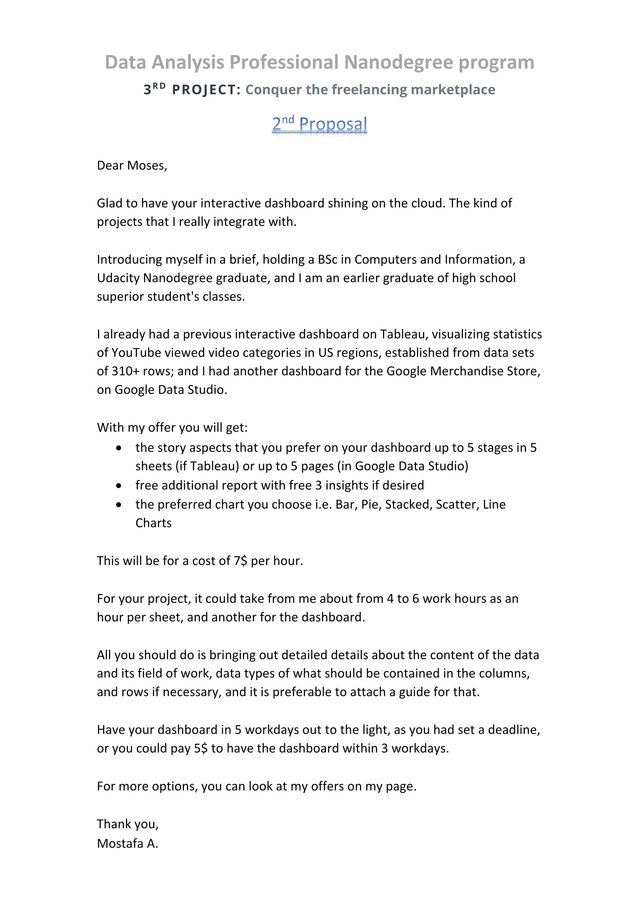

### [Project Proposal Preview](https://cutt.ly/3rd-proj---Conquer-the-freelancing-marketplaces_Proposals) 

### [3rd Project](https://cutt.ly/3rd-proj---Conquer-the-freelancing-marketplaces_Proposals), tasks short description

- The project was for creating 2 Word files, [one contains links for own prepared profiles](https://cutt.ly/3rd-proj---Conquer-the-freelancing-marketplaces_Profiles) on LinkedIn and two of available freelancing platforms, the second one was supposed to have [two project proposals](https://cutt.ly/3rd-proj---Conquer-the-freelancing-marketplaces_Proposals) on these freelancing platforms.

 *Profiles document* (*Click the photo to show the file*) 

 
 
*Proposals document* 

 
*Click the photo to show the file*

### Reviews highlights for my submissions

*__[1st review](https://cutt.ly/3rd-proj---Conquer-the-freelancing-marketplaces_Review) highlights:__*

- You have done a great job.  
- All your profiles are complete and have relevant information about you. Well done!
- You have added the profile image and summary details clearly.💯👍
- You have added the relevant skills. 💯👍
- You have enlisted your tasks. 💯👍
- You have added the relevant skills. 💯👍
- You have added the role title. 💯👍
- You have added the original country. 💯👍
- You have added the hourly rate. 💯👍
- The proposals were copy and pasted into another Word file.👍
- Start with a custom greeting 💯👍
- Make a connection with the client 💯👍
- Great job listing the relevant projects you worked before 💯👍
- Great job listing your Steps in bullet points, making your vision clear toward completing the task 💯👍
