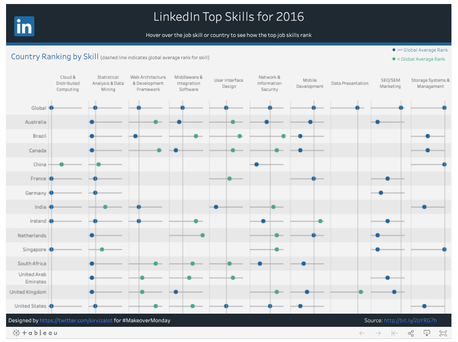
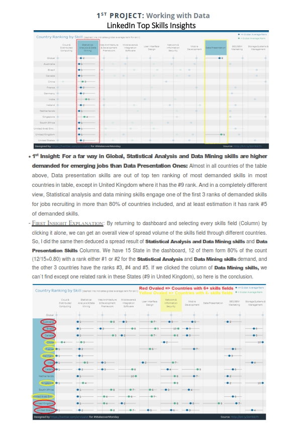

#### Project name: "Working with Data"
#### Main focused: LinkedIn jobs skills Tableau dashboard insights
### [Project Presentation Preview](https://cutt.ly/1st-Project-Working-with-Data---LinkedIn-Top-Skills-Insights_Presentation-Preview) 'insights extracted'
### [Interactive Dashboard Link](https://public.tableau.com/profile/matt.chambers#!/vizhome/LinkedInTopSkills2016-MakeoverMonday/LinkedInTopSkills2016-MakeoverMonday) 'where the insights were extracted from'

 
*A photoshoot of LinkedIn jobs skills Tableau dashboard where my insights were taken from*
 
 
*Click the photo to show the interactive dashboard*

*A photoshoot of the project presentation*
 
 
*Click the photo to show the presentation*

### [1st Project](https://cutt.ly/1st-Project-Working-with-Data---LinkedIn-Top-Skills-Insights_Presentation-Preview), tasks short description

- The project was an intended analysis for extracting insights from a "Tableau dashboard" for one of these  three subjects: 

   - [Madrid in Detail](https://public.tableau.com/views/MadridInDetail/MadridinDetail?:showVizHome=no)
   - [Malaria in Africa](https://public.tableau.com/views/MakeoverMonday34Malaria_0/MalariainAfrica?:showVizHome=no)
   - [LinkedIn Top Skills](https://public.tableau.com/profile/matt.chambers#!/vizhome/LinkedInTopSkills2016-MakeoverMonday/LinkedInTopSkills2016-MakeoverMonday)

 I set out to make [the analysis](https://cutt.ly/1st-Project-Working-with-Data---LinkedIn-Top-Skills-Insights_Presentation-Preview) about jobs skills from the LinkedIn Tableau dashboard

Here is the jobs skills online dashboard link: [LinkedIn Top Skills 2016 - MakeoverMonday - Matt Chambers - Tableau Public](https://public.tableau.com/profile/matt.chambers#!/vizhome/LinkedInTopSkills2016-MakeoverMonday/LinkedInTopSkills2016-MakeoverMonday)

### Reviews highlights for my submissions

*__[1st review](https://cutt.ly/1st-Project-Working-with-Data---LinkedIn-Top-Skills-Insights_Review_1) highlights:__*

- This is an excellent submission! You presented three very interesting insights and backed them up with some robust analysis. Great job,
keep it up! :)
- You reported three very interesting insights. Great job!
- Great job adding a descriptive heading for each insight. This not only neatly demarcates your insights, but
also gives your readers a heads up on what you're going to be talking about.
- You drew some good, air-tight conclusions from your analysis. You also presented ample data, facts and other
information from the dashboard to back your findings. Terrific! :)
- Your screenshots appropriately illustrate the written part of your response. Excellent!

*__[2nd review](https://cutt.ly/1st-Project-Working-with-Data---LinkedIn-Top-Skills-Insights_Review_2) highlights:__*

- Congratulations for your work and project submitted. Insights where very well presented and displayed properly. You really did a great
job.
- Well done.
- You have precisely described each of insight reported. Usually it comes to answer to good questions. Your job
made that happen.
- Congratulations for the great job done.
