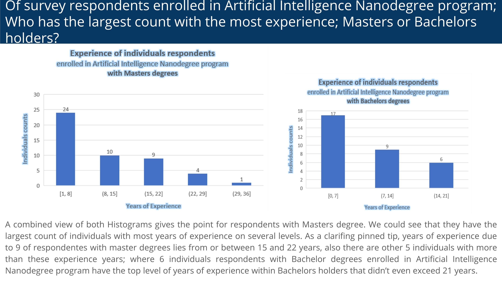

#### Project name: "Analyze Survey Data"
#### Main focused: Udacity survey visualed insights 
### [Project Presentation Preview](https://cutt.ly/2nd-Project-Analyze-Survey-Data---Visualed-Insights_Presentation-Preview)

### [2nd Project](https://cutt.ly/2nd-Project-Analyze-Survey-Data---Visualed-Insights_Presentation-Preview), tasks short description

- The project was an intended analysis for extracting insights about Udacity from survey Data.
- Attached my clean work as one [xslx workbook](https://cutt.ly/2nd-Project-Analyze-Survey-Data---Visualed-Insights_XSLX-workbook) with my [insights presentation](https://cutt.ly/2nd-Project-Analyze-Survey-Data---Visualed-Insights_Presentation-Preview).

 
*A photoshoot of the project presentation first slide*

 
*Click the photo to show the presentation*
  

  

### Review highlights for my submission

*__[1st review](https://cutt.ly/2nd-Project-Analyze-Survey-Data---Visualed-Insights_Review) highlights:__*
 
- Great work on this fine submission!
- Keep up with the solid work 
- We are waiting for your next submission
