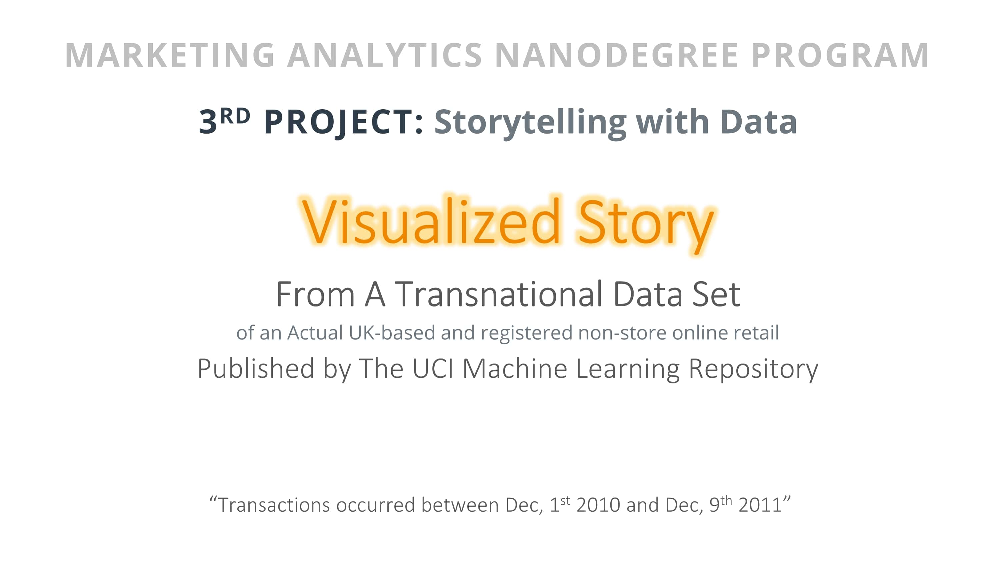

#### Project name: "Storytelling with Data"
#### Main focused: Sales marketing insights for an actual UK-based and registered non-store online retail
### [Project Presentation Preview](https://cutt.ly/3rd-Project-Storytelling-with-Data---Visualed-Story_Presentation-Preview) 'insights extracted'
### [3rd Project](https://cutt.ly/3rd-Project-Storytelling-with-Data---Visualed-Story_Presentation-Preview), tasks short description

- The project was an intended analysis for extracting marketing insights about sales for an Actual UK-based and registered non-store online retail, from a transnational data set published by The UCI Machine Learning Repository.
- Attached my clean work as one [xslx workbook](https://cutt.ly/3rd-Project-Storytelling-with-Data---Visualed-Story_XSLX-workbook) with my [story insights presentation](https://cutt.ly/3rd-Project-Storytelling-with-Data---Visualed-Story_Presentation-Preview).

 
*A photoshoot of the project presentation*

 
*Click the photo to show the presentation*
  

### Review highlights for my submission

*__[1st review](https://cutt.ly/3rd-Project-Storytelling-with-Data---Visualed-Story_Review) highlights:__*

- Congratulations on finishing the project 🎉
- This was a brilliant submission. The work was exceptional! You did a great job and should be proud of yourself. After reviewing this
submission, I am impressed and satisfied with the effort and understanding put in to make this project a success. All the requirements
have been met successfully 💯%
- Keep doing the great work and all the best for future project.
- Great work on previous suggestions!! Meets the specification.
- Great work on providing clear labeling for each of your charts.
- Nice use of color combination and font is good everywhere.
