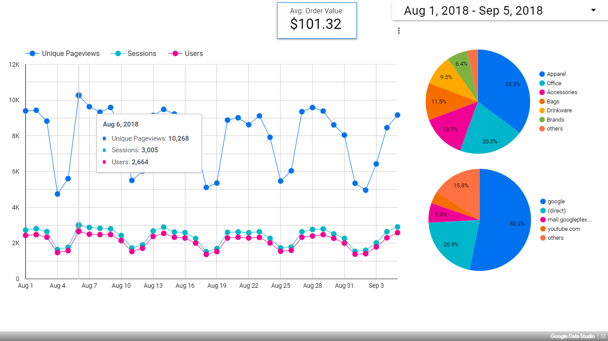

#### Project name: "Navigating, Reports, and Dashboards"
#### Main focused: Google Data Studio dashboard
### [Project Presentation Preview](https://cutt.ly/6th-Project-Navigating-Reports-and-Dashboards_Presentation-Preview)
### [6th Project](https://cutt.ly/6th-Project-Navigating-Reports-and-Dashboards_Presentation-Preview), tasks short description

 The project was for making a [report](https://cutt.ly/6th-Project-Navigating-Reports-and-Dashboards_Presentation-Preview) and a [dashboard](https://cutt.ly/6th-Project-Navigating-Reports-and-Dashboards_Google-Data-Studio-Dashboard) using Google Data Studio and Google Analytics platforms about the "Google Merchandise store".

 
*A photoshoot of my dashboard on Google Data Studio for Google Merchandise Store*
 

### Review highlights for my submission

*__[1st review](https://cutt.ly/6th-Project-Navigating-Reports-and-Dashboards_Review) highlights:__*

- Congratulations, your project is now good to go.
- Keep up the good work.
- Your screenshot clearly shows all three views created in the same property.
- Your screenshot clearly shows all the steps to create the filter.
- All the charts and insights are quite good. Well done.
- Happy Learning and Be Safe.
- Happy New Year.
