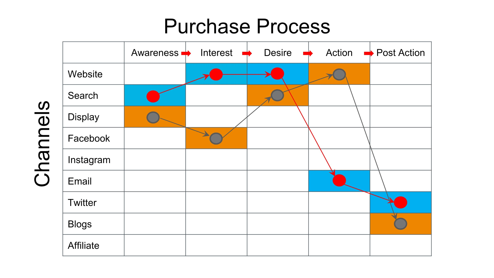

#### Project name: "Crafting an Analytic Brief"
#### Main focused: Analytic Brief for Udacity School of Business
### [Project Presentation Preview](https://cutt.ly/7th-Project-Crafting-an-Analytic-Brief---Udacity-School-of-Business_Presentation-Preview)
### [7th Project](https://cutt.ly/7th-Project-Crafting-an-Analytic-Brief---Udacity-School-of-Business_Presentation-Preview), tasks short description

 The project was intended for crafting an Analytic Brief for one of the companies below:

     - Tesla Branch New York, New York Model 3
     - Dropbox Business
     - Nike Hyperadapt (Self Lacing Shoes)
     - Lime Scooters (In your city)
     - Udacity School of Business

  I set out to make a report for each of the five, finally, I completed the work of a [report dedicated to 'Udacity School of Business'](https://cutt.ly/7th-Project-Crafting-an-Analytic-Brief---Udacity-School-of-Business_Presentation-Preview).

*A photoshoot of the project presentation first slide*

 
*Click the photo to show the presentation*
  

  

### Review highlights for my submission

*__[1st review](https://cutt.ly/7th-Project-Crafting-an-Analytic-Brief---Udacity-School-of-Business_Review) highlights:__*

- Congratulations on finishing the project 🎉
This was a brilliant submission. The work was exceptional! You did a great job and should be proud of yourself. After reviewing this
submission, I am impressed and satisfied with the effort and understanding put in to make this project a success. All the requirements
have been met successfully 100%
Keep doing the great work and all the best for future project.
- Nice, you have correctly answered relevant actionable segments that exists.
- Great work providing excellent detailed answers to all the questions
- You have nicely provided a purchase process flow and identified the avenues for the funnel. Great work!!
