#### Project name: "Create a Proposal for the Next Quarter"
#### Main focused: Evaluating the performance of the Black Friday sales for 2017 & 2018
### [Project Presentation Preview](https://cutt.ly/8th-Final-Project---evaluating-the-performance-of-the-Black-Friday-sales-for-2017-and-2018_Presentation-Preview)
### [8th Project](https://cutt.ly/8th-Final-Project---evaluating-the-performance-of-the-Black-Friday-sales-for-2017-and-2018_Presentation-Preview), tasks short description

 The project was intended to analyze marketing data and craft a Campaign Report by evaluating the performance of the Black Friday sales for 2017 & 2018 using a data set on Google Sheet. 

 Attached my clean work as one [xslx workbook](https://cutt.ly/8th-Final-Project---evaluating-the-performance-of-the-Black-Friday-sales-for-2017-and-2018_XSLX-Workbook) with [my evaluating presentation](https://cutt.ly/8th-Final-Project---evaluating-the-performance-of-the-Black-Friday-sales-for-2017-and-2018_Presentation-Preview) that includes the vizs.

*A photoshoot of the project presentation first slide*
<a title="A photo of first slide" href="https://cutt.ly/7th-Project-Crafting-an-Analytic-Brief---Udacity-School-of-Business_Presentation-Preview">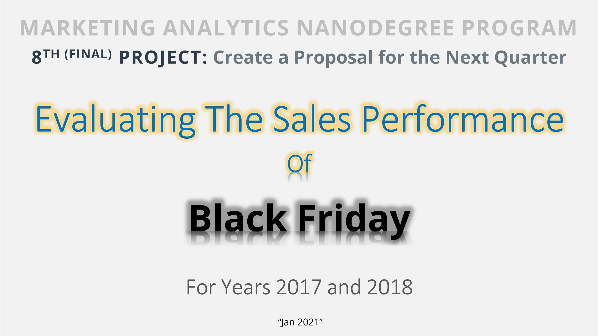</a>
 
*Click the photo to show the presentation*
  
<a title="A photo of second slide" href="https://cutt.ly/8th-Final-Project---evaluating-the-performance-of-the-Black-Friday-sales-for-2017-and-2018_Presentation-Preview">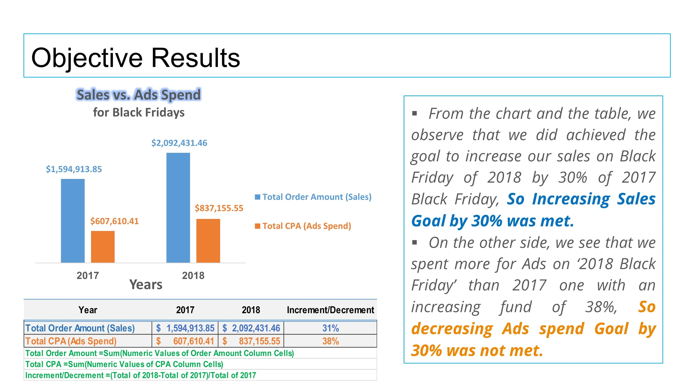</a>
<a title="A photo of third slide" href="https://cutt.ly/8th-Final-Project---evaluating-the-performance-of-the-Black-Friday-sales-for-2017-and-2018_Presentation-Preview">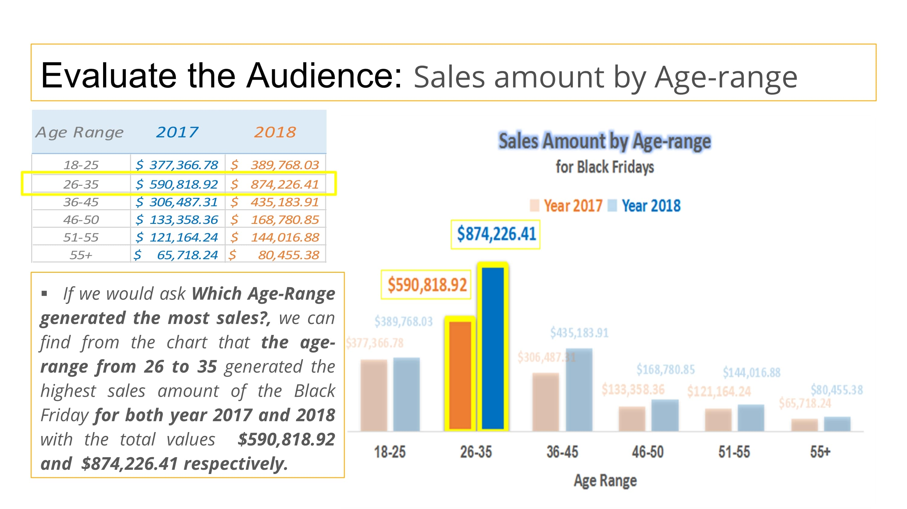</a>
<a title="A photo of fourth slide" href="https://cutt.ly/8th-Final-Project---evaluating-the-performance-of-the-Black-Friday-sales-for-2017-and-2018_Presentation-Preview">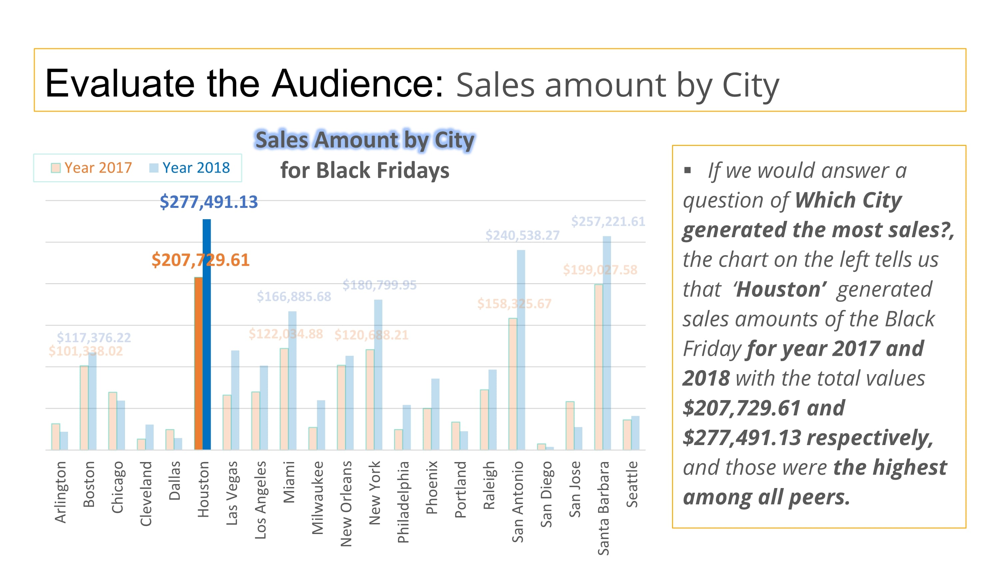</a>
<a title="A photo of fifth slide" href="https://cutt.ly/8th-Final-Project---evaluating-the-performance-of-the-Black-Friday-sales-for-2017-and-2018_Presentation-Preview">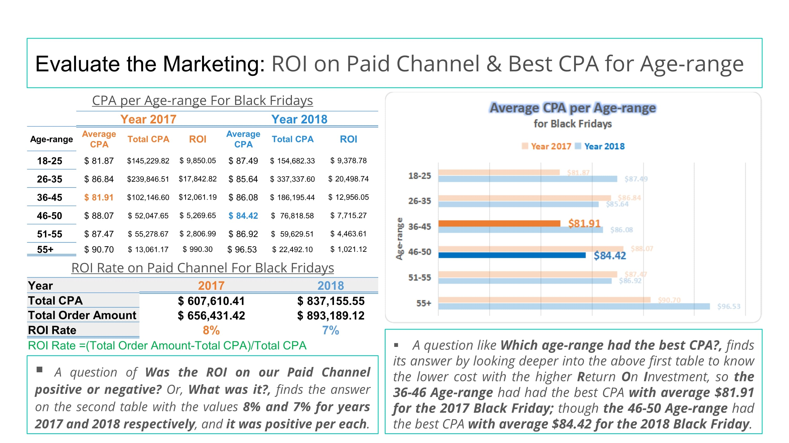</a>
<a title="A photo of sixth slide" href="https://cutt.ly/8th-Final-Project---evaluating-the-performance-of-the-Black-Friday-sales-for-2017-and-2018_Presentation-Preview">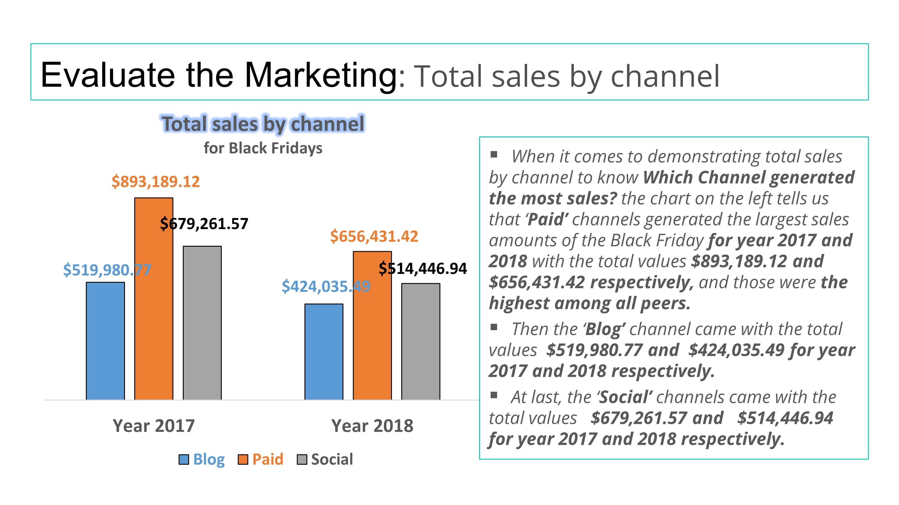</a>
<a title="A photo of seventh slide" href="https://cutt.ly/8th-Final-Project---evaluating-the-performance-of-the-Black-Friday-sales-for-2017-and-2018_Presentation-Preview">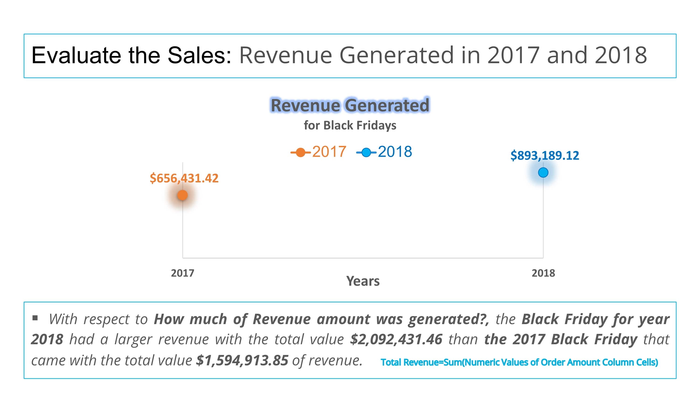</a>
<a title="A photo of eighth slide" href="https://cutt.ly/8th-Final-Project---evaluating-the-performance-of-the-Black-Friday-sales-for-2017-and-2018_Presentation-Preview">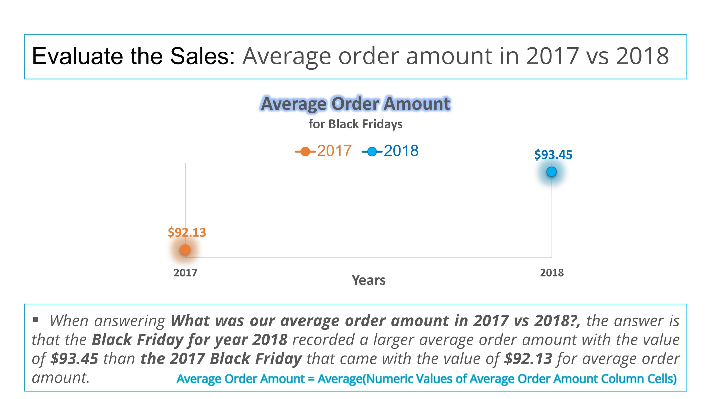</a>
<a title="A photo of ninth slide" href="https://cutt.ly/8th-Final-Project---evaluating-the-performance-of-the-Black-Friday-sales-for-2017-and-2018_Presentation-Preview">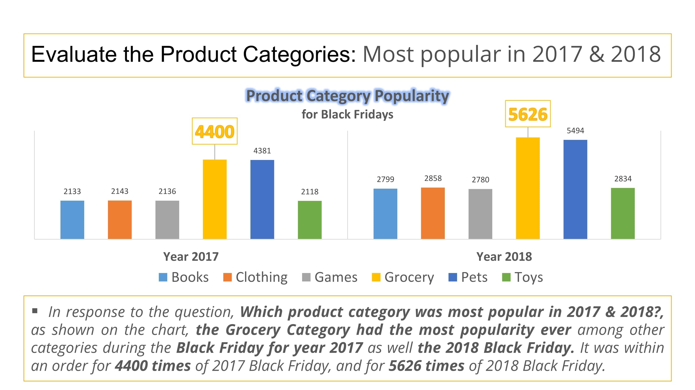</a>
<a title="A photo of tenth slide" href="https://cutt.ly/8th-Final-Project---evaluating-the-performance-of-the-Black-Friday-sales-for-2017-and-2018_Presentation-Preview">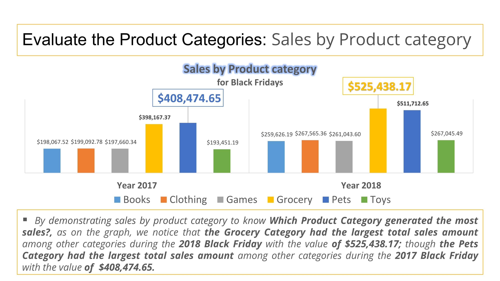</a>
<a title="A photo of eleventh slide" href="https://cutt.ly/8th-Final-Project---evaluating-the-performance-of-the-Black-Friday-sales-for-2017-and-2018_Presentation-Preview">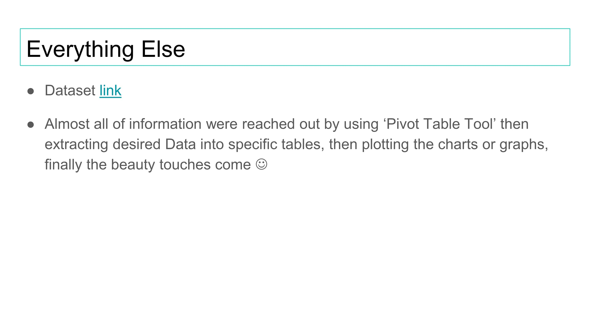</a>
  
<a title="A photo of twelfth slide" href="https://cutt.ly/8th-Final-Project---evaluating-the-performance-of-the-Black-Friday-sales-for-2017-and-2018_Presentation-Preview">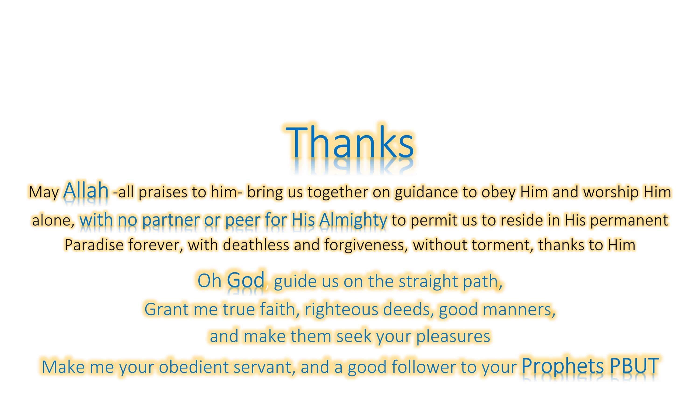</a>

### Reviews highlights for my submissions

*__[1st review](https://cutt.ly/8th-Final-Project---evaluating-the-performance-of-the-Black-Friday-sales-for-2017-and-2018_Review_1) highlights:__*

- Good job. The bar chart and table are great for representing the sales and ad spend data for 2017 and 2018. They are ideal for representing diàerent groups of data and changes over time.
- Restating the sales and ad spend goals give context to the analyses and conclusions drawn.
The student clearly indicates that the sales goal was met, and the ad spend goal was not met.
- Awesome job analyzing the sales data by age group, and city.
The visuals are appropriate for the datasets presented; the bar have the relevant titles and labels.
Short notes have been added to describe the charts.
- All relevant audience-related questions have been included.
- Supporting text has been included to describe the visuals and to answer the questions.
- Good job presenting the ROI on paid channels and the CPA per age group.
Supporting texts have been included to give context to the analyses and to answer the marketing
questions.
- All Sales information has been presented in the appropriate visuals.
Short notes have also been included to report on the total revenue and average sales order for each
year.
The sales question for slide 8 has also been included.
- Good job choosing the right metrics to determine the popularity of each product category; the number
of orders.
- The sales values for each product category have also been included.

*__[2nd review](https://cutt.ly/8th-Final-Project---evaluating-the-performance-of-the-Black-Friday-sales-for-2017-and-2018_Review_2) highlights:__*

- Congratulations on passing this submission . This is an impressive submission with detailed notes, clear visuals and neat
presentation. Thank you for carefully incorporating the previous feedback into this update too. Please keep it up.
Please continue to invest your best in the growth and development opportunities. Beyond the Nanodegree, we are confident that this
level of commitment will pay off.
We wish you the very best in future projects and endevours.
Kind regards,
- Excellent! The CPA per age group is accurate and the age group with the best CPA has been identified.
- Great! The sales question for slide has been included.
